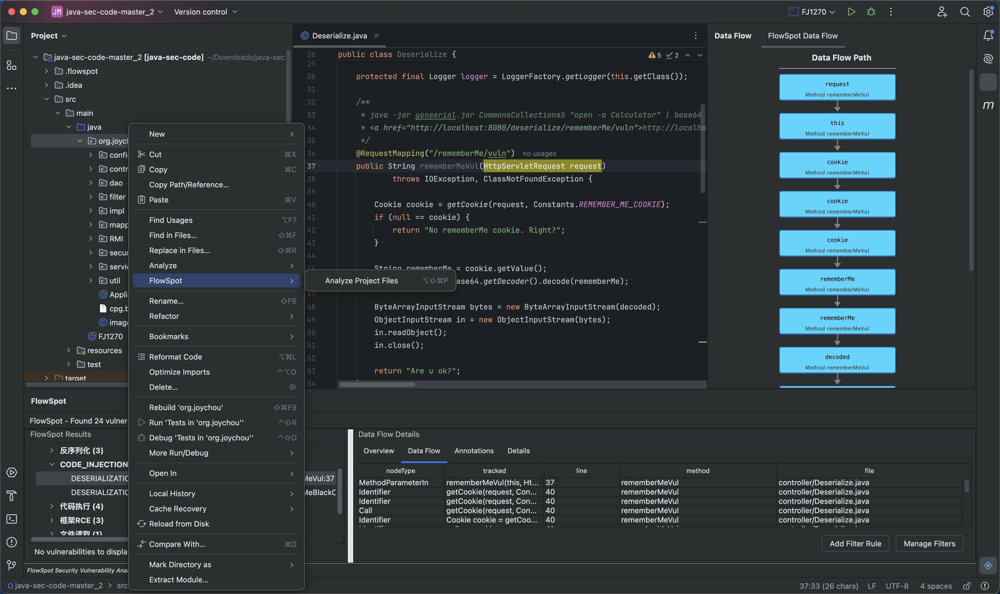
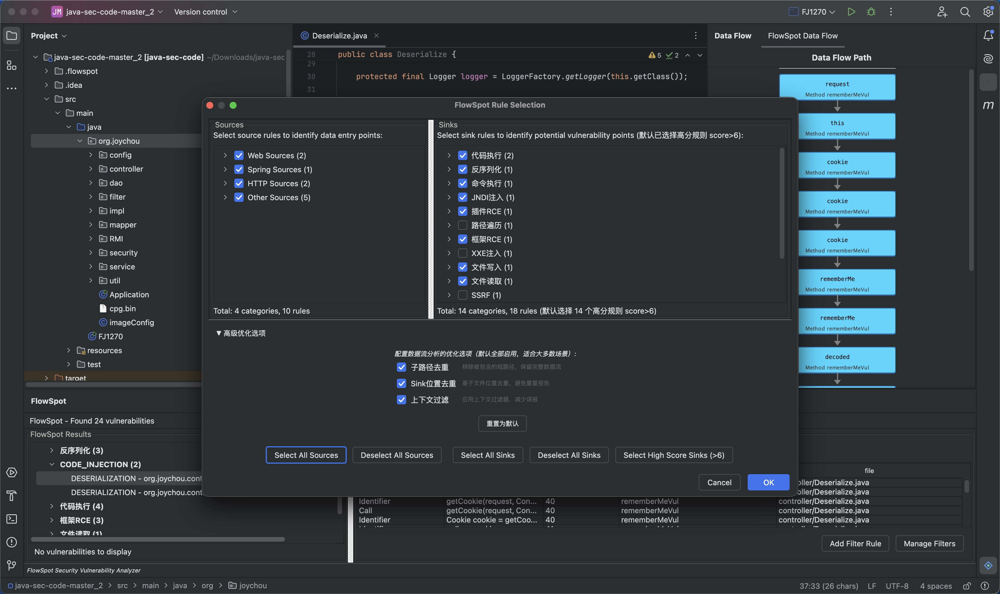
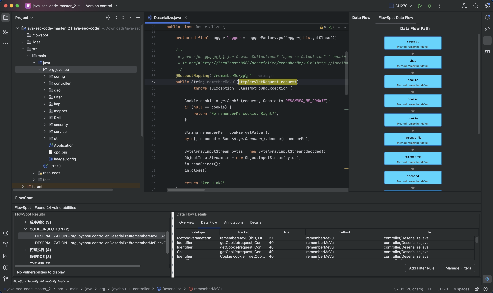

# FlowSpot IntelliJ 插件

基于 Joern 的 IntelliJ IDEA 安全漏洞检测插件，提供强大的静态代码分析能力。

## 📋 目录

- [项目简介](#项目简介)
- [环境要求](#环境要求)
- [编译构建](#编译构建)
- [安装启动](#安装启动)
- [使用说明](#使用说明)
- [常见问题](#常见问题)
- [许可证](#许可证)

---

## 📖 项目简介

FlowSpot IntelliJ 插件是一款专业的安全漏洞检测工具，集成了 FlowSpot 静态分析引擎（基于 Joern），能够帮助开发者在开发阶段及时发现和修复安全问题。

**主要特性：**
- 🔍 支持多种安全漏洞检测（SQL注入、命令注入、路径遍历等）
- 🎯 精确定位漏洞在源代码中的位置
- 📊 可视化数据流分析和漏洞报告
- ⚙️ 支持自定义污点源（Source）和污点汇（Sink）规则
- 🚀 实时分析，支持项目级和文件级扫描

---

## 💻 环境要求

在开始之前，请确保您的开发环境满足以下要求：

- **JDK 21+**：Java 开发工具包
- **IntelliJ IDEA 2023.3+**：社区版或旗舰版均可
- **Gradle 8.12+**：构建工具（项目已包含 Gradle Wrapper）

---

## 🔨 编译构建

### 1. 克隆项目

```bash
git clone https://github.com/zhzhdoai/flowspot-intellij-plugin.git
cd flowspot-intellij-plugin
```

### 2. 配置 Gradle 属性

编辑 `flowspot-plugin/gradle.properties` 文件，设置您的 IntelliJ IDEA 安装路径：

```properties
# IntelliJ IDEA 安装路径（根据您的实际路径修改）
idea.home.path=/Applications/IntelliJ IDEA CE.app/Contents

# 平台版本
platformType=IC
platformVersion=2024.3
```

### 3. 构建插件

```bash
# 1. 构建 FlowSpot 分析引擎
cd flowspot-omni-src-0.8
sbt clean compile && sbt proguard && sbt copyDependencies

# 2. 运行插件
cd ../flowspot-plugin
./gradlew compileJava
./gradlew buildPlugin
```

构建成功后，插件 ZIP 文件将生成在：
```
flowspot-plugin/build/distributions/FlowSpot-1.0.0.zip
```

---

## 🚀 安装启动

### 方式一：从磁盘安装（推荐）

1. 打开 IntelliJ IDEA
2. 进入 `Settings/Preferences` → `Plugins`
3. 点击齿轮图标 ⚙️ → 选择 `Install Plugin from Disk...`
4. 选择构建好的 ZIP 文件：`build/distributions/FlowSpot-1.0.0.zip`
5. 点击 `OK` 并重启 IntelliJ IDEA

### 方式二：开发模式运行

适合开发和调试，需要先构建 FlowSpot 引擎：

```bash
# 1. 构建 FlowSpot 分析引擎
cd flowspot-omni-src-0.8
sbt clean compile && sbt proguard && sbt copyDependencies

# 2. 运行插件
cd ../flowspot-plugin
./gradlew compileJava
./gradlew runIde
```

此命令会启动一个新的 IntelliJ IDEA 实例，插件已自动加载。

---

## 🧪 测试示例

如果您想测试插件功能，可以使用我们提供的测试代码库：

```bash
# 克隆测试代码
git clone https://github.com/zhzhdoai/LintSight.git
cd LintSight/java-sec-code-checkmark

# 使用 IntelliJ IDEA 打开该项目，然后运行 FlowSpot 分析
```

测试代码地址：[java-sec-code-checkmark](https://github.com/zhzhdoai/LintSight/tree/main/java-sec-code-checkmark)

该测试项目包含多种常见的安全漏洞示例，适合用来验证插件的检测能力。

---

## 📘 使用说明

### 第一步：选择分析范围

安装插件后，在 IntelliJ IDEA 中打开您的 Java 项目，然后选择分析范围：




### 第二步：配置扫描规则

在弹出的规则选择对话框中，选择要检测的污点源（Sources）和污点汇（Sinks）：

- **Sources 标签页**：选择数据输入点（如 `HttpServletRequest.getParameter`、`System.getenv` 等）
- **Sinks 标签页**：选择危险操作点（如 `Statement.executeQuery`、`Runtime.exec` 等）

支持批量选择和取消选择，配置完成后点击 `OK` 开始分析。



### 第三步：查看分析结果

分析完成后，FlowSpot 工具窗口会自动显示检测结果：

- **左侧面板**：显示分析统计信息（漏洞总数、严重程度分布）
- **右侧面板**：显示选中漏洞的详细数据流路径
- **下方面板**：树形结构展示所有检测到的漏洞

点击任意漏洞项，可以查看详细信息并跳转到对应的源代码位置。




### 自定义规则

#### 添加自定义 Sink 规则

您可以通过修改 `sinks.json` 文件来添加新的 Sink 规则，有两种方式：

**方式一：修改项目配置（推荐）**

1. 找到当前项目的配置文件：`<项目根目录>/.flowspot/sinks.json`
2. 按照以下格式添加新规则：
```json
{
  "sinks": [
    {
      "name": "自定义危险方法",
      "pattern": "com.example.MyClass.dangerousMethod"
    }
  ]
}
```
3. 保存后直接生效，无需重新构建

**方式二：修改全局配置**

1. 找到全局配置文件：`flowspot-omni-src-0.8/config/sinks.json`
2. 添加新规则（格式同上）
3. 重新构建插件后生效

#### 添加自定义 Source 规则

Source 规则目前需要通过修改代码添加：

1. 编辑源代码文件（具体位置请参考开发文档）
2. 添加新的 Source 规则定义
3. 重新编译插件

---

## ❓ 常见问题

### 1. 编译失败：JDK 版本不匹配

**问题**：构建时提示 JDK 版本错误

**解决方案**：
```bash
# 检查 JDK 版本
java -version  # 应该是 21 或更高版本

# 设置 JAVA_HOME 环境变量
export JAVA_HOME=/path/to/jdk-21
```

### 2. 插件无法加载

**问题**：安装后插件无法在 IntelliJ IDEA 中加载

**解决方案**：
- 确认 IntelliJ IDEA 版本为 2023.3 或更高
- 查看 IDE 日志：`Help` → `Show Log in Finder/Explorer`
- 检查插件兼容性设置

### 3. 分析无结果

**问题**：分析完成但没有显示任何漏洞

**解决方案**：
- **确保项目已成功编译**：插件仅对 Java 文件进行分析，需要确保被分析的代码已被反编译成 java 文件
- **第三方依赖**：可以选择不分析第三方依赖库，只关注项目源代码
- **检查引擎文件**：确认 FlowSpot 引擎 JAR 文件存在：`flowspot-omni-src-0.8/target/omni-0.1.0-SNAPSHOT.jar`
- **规则配置**：确认至少选择了一个 Source 和一个 Sink 规则（Source为空则仅输出sink扫描结果）
- **查看日志**：检查项目根目录的 `.flowspot/` 文件夹中的分析日志

### 4. 内存不足错误

**问题**：分析大型项目时出现 OutOfMemoryError

**解决方案**：
增加 IntelliJ IDEA 的内存配置：

1. 打开 `Help` → `Edit Custom VM Options...`
2. 添加或修改以下配置：
```
-Xmx8192m
-Xms2048m
```
3. 重启 IntelliJ IDEA

### 日志文件位置

分析日志保存在项目根目录：
```
<项目根目录>/.flowspot/
└── flowspot_analysis_YYYY-MM-DD_HH-MM-SS.log
```

---

## 📄 许可证

本项目采用 **Apache License 2.0** 开源协议，详见 [LICENSE](LICENSE) 文件。

```
Copyright 2024 FlowSpot Plugin Contributors

Licensed under the Apache License, Version 2.0 (the "License");
you may not use this file except in compliance with the License.
You may obtain a copy of the License at

    http://www.apache.org/licenses/LICENSE-2.0

Unless required by applicable law or agreed to in writing, software
distributed under the License is distributed on an "AS IS" BASIS,
WITHOUT WARRANTIES OR CONDITIONS OF ANY KIND, either express or implied.
See the License for the specific language governing permissions and
limitations under the License.
```

---

## 🔗 相关链接

- **项目地址**：[https://github.com/zhzhdoai/flowspot-intellij-plugin](https://github.com/zhzhdoai/flowspot-intellij-plugin)
- **问题反馈**：[GitHub Issues](https://github.com/zhzhdoai/flowspot-intellij-plugin/issues)
- **Joern 文档**：[https://joern.io](https://joern.io)

---

<div align="center">

**FlowSpot IntelliJ Plugin** - 让安全分析更简单、更高效！

</div>
